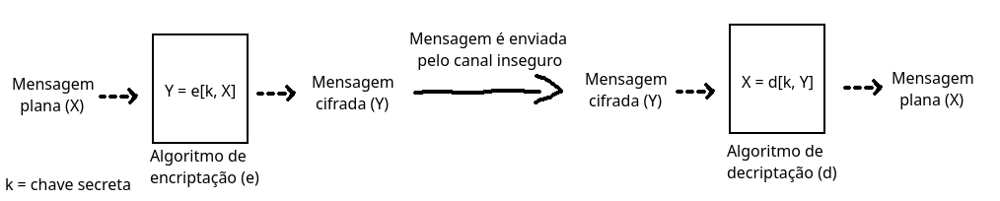

# Segurança da Informação :computer: :lock:
Material de estudo da disciplina Segurança da Informação do curso de Sistemas de Informação da UFF.

## Alguns conceitos
* Mensagem plana: Uma mensagem definida em um formato diretamente legível;
* Mensagem cifrada: Uma mensagem definida em um formato codificado;

## Modelos de Cifras Simétricas
> [Link para a aula](https://youtu.be/1cYrdBt7dk8)

### Cifra de chave simétrica (ou chave secreta)
> Segurança de Computadores, Stallings/Brown - Cap 2, pag 36.

Incontáveis indivíduos e grupos, de Júlio César à força-tarefa do U-boat alemão, a usuários diplomáticos, militares e comerciais de hoje, usaram e usam cifração simétrica para comunicações secretas. Ela permanece como o mais amplamente usado dos dois tipos de cifração Sua cifra é ferramenta para confiencialidade. O modelo funciona da seguinte maneira:
```
Uma função de encriptação *e* recebe como input a mensagem plana *x* enviada pelo usuário e uma chave secreta *k*, gerando uma uma mensagem cifrada *y*.

A mensagem cifrada então é transmitida pelo canal inseguro para o destinatário.

Ao chegar no destinatário, a mensagem cifrada *y* é então descriptografada por uma função *d*, que recebe como input a mensagem cifrada e a chave secreta *k*, gerando a mensagem plana original.
```


O remetente envia uma mensagem plana X que é passada como parâmetro para uma função de encriptação *e*, que 

Notas importantes:
- O algorítimo geralmente é mantido **público** e a chama é mantida **secreta**;
- Tanto o remetente quanto o destinatário tem acesso a chave secreta.

### Cifra de substituição
Nesse algorítmo, uma função recebe uma mensagem plana X e substitui cada caracter de X conforme uma determinada regra pré-determinada.

Exemplo:
```
Alfabeto normal: abcdefghijklmnopqrstuvwxyz
Alfabeto para cifragem: qwertyuiopasdfghjklzxcvbnm

Mensagem plana: batata
Nova mensagem substituindo as letras do alfabeto normal pelo alfabeto para cifragem: wqzqzq

Número total de chaves para esse código: Permutação entre as letras do alfabeto = 25! ≅ 2^88
```